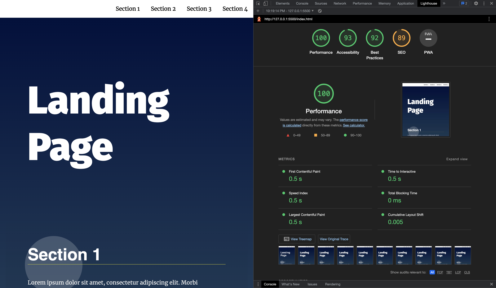

# Landing Page Project for Udacity Nanodegree Program

## Project Overview

This is the final project for the Udacity Frontend Development Nanodegree program. In this project I show use DOM manipulation to create a navbar, automate styling each time a new section gets added, and interaction to the webpage with event listeners (specifically for scrolling and click events).

It was challenging getting the scrollIntoView function to work but it turned out great overall.

The HTML and CSS was provided courtesy of Udacity. I added in some CSS to properly position the nav list items.

===============================

## Flowchart (made with MindNode)

This flowchart I created kept me on track with knowing the order of the DOM elements and what I needed to add or manipulate. Also keeping note of the class and id names.

[DOM Flowchart:](./assets/Mind%20Map.pdf)

================================

## Lighthouse Report

Accesibility Report: 

=================================

## Resources and Articles I used for reference

JS Challenger: <https://www.jschallenger.com/javascript-dom-exercises/>

Codewars: <https://www.codewars.com/dashboard>

Join Method: <https://developer.mozilla.org/en-US/docs/Web/JavaScript/Reference/Global_Objects/Array/join>

Filter Method: <https://developer.mozilla.org/en-US/docs/Web/JavaScript/Reference/Global_Objects/Array/filter>

From Method: <https://developer.mozilla.org/en-US/docs/Web/JavaScript/Reference/Global_Objects/Array/from>

Ternary Operator: <https://www.programiz.com/javascript/ternary-operator>

DOM Manipulation Article: <https://generalassemb.ly/blog/dom-manipulation-changing-website-response-user-actions/>

An article I spent a lot of time reading for refactoring code: <https://www.testim.io/blog/javascript-refactoring-5-plays-to-improve-code-quality/>

====================================

## Special Thanks

Thanks to all of the Udacity Session Leads and my classmates for all the help and motivation to stick it through. Attending Udacity while also going to an in-person bootcamp is no easy task, but I became a stronger coder because of it!
